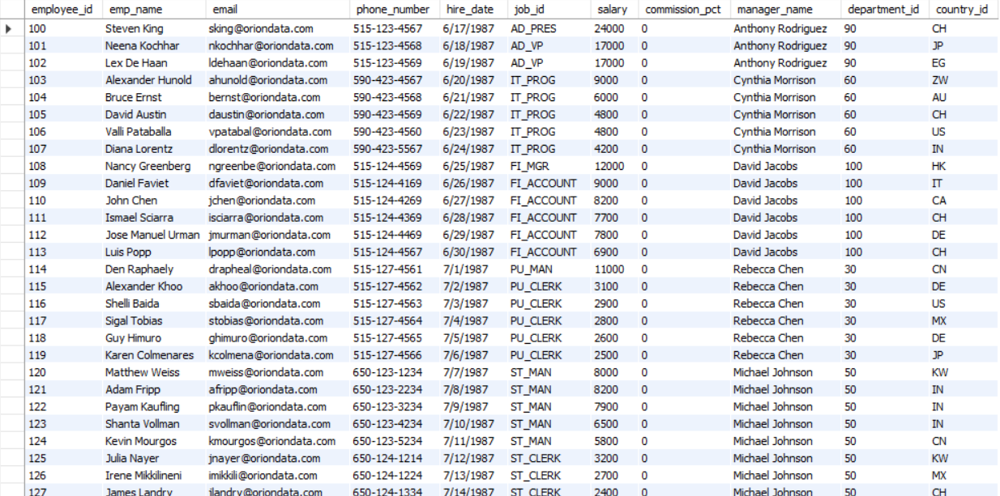

# Orion Data Systems – SQL Workforce Analytics Report
This report focuses on query-based analysis using MySQL; therefore, insights are presented through structured SQL queries.

## Executive Summary
Orion Data Systems required deeper visibility into its workforce data to support strategic human resource and operational decisions. The HR & Strategy team needed answers to key questions around employee distribution, salary structure, job roles, and geographic presence.

Using MySQL, this project analyzed employee, department, job, and country-level data to uncover insights related to workforce size, compensation patterns, and operational gaps. The analysis provides a clear, query-driven overview of the organization’s workforce and highlights areas for strategic attention, including high-earning roles, salary concentration by country, and job roles without assigned employees.

## Business Problem
As a multinational consulting and technology firm, Orion Data Systems operates across multiple countries and departments. However, decision-makers lacked a structured analytical view of their workforce data.

The objective of this project was to use SQL to transform raw HR data into actionable insights that support workforce planning, compensation benchmarking, and organizational optimization.

### Key Questions Addressed
- How are employees distributed across departments?
- Which departments and job roles command the highest average salaries?
- How are employees distributed across salary bands?
- What is the company’s workforce and salary footprint across countries?
- Are there job roles currently unfilled within the organization?

## The Process (Methodology)
### Tools Used:
MySQL, MySQL Workbench

### Data Overview
The dataset consists of multiple relational tables, including employees, departments, jobs, and countries. These tables collectively capture employee demographics, compensation, job roles, departmental structure, and geographic presence.

### Data Preparation
- All analysis were conducted within a dedicated MySQL schema named 'capstone'.
- The datasets were imported from CSV files into MySQL tables, ensuring correct data types and relational integrity.
- SQL joins, subqueries, CASE statements, and Common Table Expressions (CTEs) were used to answer the business questions.

## Analysis & Key Insights
This section summarizes the major insights derived from the SQL queries executed.

### Workforce Distribution
- Employee counts vary significantly across departments, highlighting uneven workforce allocation.
- One department emerged as the largest by headcount, indicating higher operational demand or scope.

### Salary Structure & Bands
- Average salary analysis revealed clear differences in compensation across departments and job roles.
- Employees were grouped into Low, Medium, and High salary bands, providing clarity on income distribution within the organization.

### High Earners & Job Roles
- A subset of employees earn above the company-wide average salary, typically associated with specialized or senior job roles.
- Certain job titles recorded average salaries above 12,000, indicating high-value positions within the company.

### Geographic Salary Footprint
- Total salary costs vary by country, reflecting differences in workforce size and compensation levels.
- Some countries account for a disproportionately higher share of total salary expenditure.

### Workforce Gaps
The analysis identified job roles that currently have no employees assigned, signaling potential hiring gaps or deprecated roles within the organization. The analysis therefore, showed they were no vacant roles.

## Recommendations
Based on the SQL analysis, the following recommendations are proposed:
- Review departments with exceptionally high or low headcounts to ensure optimal workforce allocation.
- Conduct deeper evaluation of high-paying job roles to assess return on investment and succession planning.
- Monitor salary concentration by country to manage labor costs effectively.
- Investigate job roles without assigned employees to determine whether recruitment or role restructuring is required.

## Link
[SQL Script](https://github.com/udokamoses/orion-workforce-report/main/moses_udoka.sql)

